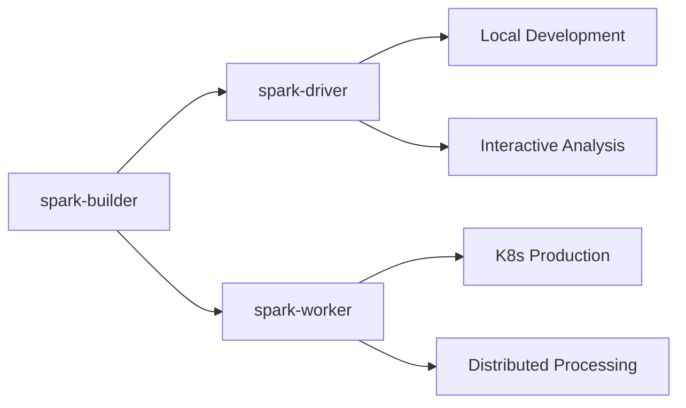

# Jupyter Spark Master Docker

[](https://github.com/bjornjorgensen/jupyter-spark-master-docker/actions)
[](https://hub.docker.com/r/bjornjorgensen/spark-driver)

A comprehensive Docker-based development environment for distributed data science, featuring daily-built images that combine Debian Testing, JupyterLab, Apache Spark (master branch), and optimized Python packages. Designed for seamless scaling from local development to production Kubernetes deployments.

## 🚀 Quick Start

### Option 1: Using the Development Helper Script (Recommended)
```bash
# Clone the repository
git clone https://github.com/bjornjorgensen/jupyter-spark-master-docker.git
cd jupyter-spark-master-docker

# Initial setup
./dev.sh setup

# Start the environment
./dev.sh start

# Access JupyterLab at http://localhost:8888
./dev.sh notebook
```

### Option 2: Manual Setup
```bash
# Copy and configure environment
cp .env.example .env
# Edit .env with your preferred JUPYTER_TOKEN and settings

# Create necessary directories
mkdir -p test_notebooks data

# Start services
docker-compose up -d
```

Access points:
- **JupyterLab**: http://localhost:8888 (use token from `.env` file)
- **Spark UI**: http://localhost:4040 (when running Spark jobs)

## ✨ Key Features

- **🏗️ Multi-Stage Build System**: Optimized three-stage Docker build (spark-builder → spark-driver/spark-worker)
- **🔄 Daily Fresh Builds**: Automated daily builds at 7 AM UTC with latest Spark master branch
- **🧪 Bleeding-Edge Spark**: Latest Apache Spark features with Python and Kubernetes support
- **📊 JupyterLab Integration**: Full-featured development environment with pandas-on-spark
- **☸️ Kubernetes Ready**: Production-ready Helm charts with RBAC and persistent volumes
- **⚡ Performance Optimized**: `uv` package manager, Kryo serialization, adaptive query execution
- **🛡️ Security Focused**: Non-root containers, token-based auth, RBAC-enabled deployments
- **🔧 Developer Friendly**: Helper scripts, health checks, and comprehensive logging

## 📋 Prerequisites

- Docker and Docker Compose
- For Kubernetes: kubectl and Helm
- Minimum 4GB RAM recommended
- For production: 16GB+ RAM recommended

## 🏗️ Architecture

### Multi-Stage Build System

The project uses a sophisticated three-stage build process optimized for both build time and image size:

#### 1. **spark-builder** (Base Foundation)
- **Purpose**: Compiles Apache Spark from source with all build dependencies
- **Location**: `spark-builder/Dockerfile`
- **Features**: 
  - Self-contained build environment with Maven, SBT, and build tools
  - Compiles Spark master branch with `./dev/make-distribution.sh --name custom-spark --pip --tgz -Pkubernetes`
  - Includes S3A support with AWS SDK 1.12.608 and Hadoop 3.3.6
  - OpenJDK 25 for latest compatibility

#### 2. **spark-driver** (Development Environment)
- **Purpose**: JupyterLab-enabled container for interactive data science
- **Location**: `driver/Dockerfile`
- **Features**:
  - Full JupyterLab installation with extensions
  - Pandas-on-Spark integration
  - Development tools and debugging capabilities
  - Jupyter notebook configuration for Spark integration

#### 3. **spark-worker** (Execution Nodes)
- **Purpose**: Lightweight Spark executor nodes for distributed processing
- **Location**: `worker/Dockerfile`
- **Features**:
  - Minimal runtime with only essential Spark dependencies
  - Optimized for memory and CPU efficiency
  - Kubernetes-ready with proper signal handling (tini)

### Technology Stack

| Component | Version/Type | Purpose |
|-----------|-------------|---------|
| **Base OS** | Debian Testing | Rolling release for latest packages |
| **Python** | Latest stable | Runtime with `uv` package manager |
| **Spark** | Master branch | Bleeding-edge features + Kubernetes support |
| **Java** | OpenJDK 25 | Latest JVM optimizations |
| **Storage** | S3A/Hadoop | Object storage integration |
| **Container Runtime** | tini | Proper signal handling |

### Build Flow



### Daily Build Process

- **Trigger**: Every day at 7 AM UTC via GitHub Actions
- **Parallelization**: spark-driver and spark-worker build simultaneously after spark-builder
- **Caching**: GitHub Actions cache for faster subsequent builds
- **Testing**: Multi-platform build verification (linux/amd64)

## �️ Development Tools

### Helper Script (`dev.sh`)

The project includes a comprehensive development helper script that streamlines common workflows:

```bash
# Setup and management
./dev.sh setup      # Initial setup: copy .env.example, create directories
./dev.sh start      # Start the development environment
./dev.sh stop       # Stop the development environment
./dev.sh restart    # Restart services
./dev.sh status     # Show container status

# Development workflow
./dev.sh logs       # Show container logs (follows)
./dev.sh shell      # Open bash shell in running container
./dev.sh notebook   # Open JupyterLab in browser
./dev.sh spark-ui   # Open Spark UI in browser

# Maintenance
./dev.sh build      # Build images locally
./dev.sh clean      # Stop and remove containers, networks, volumes
./dev.sh help       # Show all available commands
```

### Directory Structure
```
jupyter-spark-master-docker/
├── .env                    # Your environment configuration
├── .env.example           # Template with default values
├── dev.sh                 # Development helper script
├── docker-compose.yaml    # Local development services
├── test_notebooks/        # Your Jupyter notebooks (auto-created)
├── data/                  # Data files (auto-created)
├── charts/                # Kubernetes Helm chart
│   └── pyspark-notebook/  # Production deployment templates
├── driver/                # JupyterLab + Spark driver image
├── worker/                # Spark worker image
└── spark-builder/         # Base Spark compilation image
```

## �🐳 Usage

### Local Development

1. **Configuration**: Copy and customize the environment file:
   ```bash
   cp .env.example .env
   # Edit JUPYTER_TOKEN and other settings
   ```

2. **Start Services**:
   ```bash
   docker-compose up -d
   ```

3. **Access Points**:
   - JupyterLab: http://localhost:8888
   - Spark UI: http://localhost:4040

### Directory Structure
```
your-project/
├── .env                 # Your environment configuration
├── data/               # Mount point for datasets
├── test_notebooks/     # Jupyter notebooks
└── docker-compose.yaml # Service configuration
```

### Local Development Example

Here's how to set up Spark for optimal local development with automatic resource detection:

```python
import multiprocessing
import os
import numpy as np
import pandas as pd
import pyarrow as pa
from pyspark import pandas as ps  # pandas-on-spark API
from pyspark.sql import SparkSession
import pyspark.sql.functions as F

# Auto-detect system resources
number_cores = multiprocessing.cpu_count()
mem_bytes = os.sysconf("SC_PAGE_SIZE") * os.sysconf("SC_PHYS_PAGES")
memory_gb = int(mem_bytes / (1024.0 ** 3))

# Reserve 2GB for system, use rest for Spark
spark_memory = max(2, memory_gb - 2)

print(f"System detected: {number_cores} cores, {memory_gb}GB RAM")
print(f"Allocating {spark_memory}GB to Spark driver")

# Initialize SparkSession with optimized local configuration
spark = (SparkSession.builder
         .appName("jupyter-spark-local")
         .master(f"local[{number_cores}]")  # Use all CPU cores
         .config("spark.driver.memory", f"{spark_memory}g")
         .config("spark.driver.maxResultSize", "2g")  # Increase result size limit
         .config("spark.sql.adaptive.enabled", "true")  # Enable AQE
         .config("spark.sql.adaptive.coalescePartitions.enabled", "true")
         .config("spark.serializer", "org.apache.spark.serializer.KryoSerializer")
         .config("spark.sql.repl.eagerEval.enabled", "true")  # Show DataFrames automatically
         .config("spark.sql.repl.eagerEval.maxNumRows", "20")
         .config("spark.sql.repl.eagerEval.truncate", "100")
         .getOrCreate())

# Set log level to reduce noise (change to "INFO" or "DEBUG" for troubleshooting)
spark.sparkContext.setLogLevel("WARN")

# Verify configuration
print("Spark Session created successfully!")
print(f"Spark Version: {spark.version}")
print(f"Master: {spark.sparkContext.master}")
print(f"App Name: {spark.sparkContext.appName}")

# Enable pandas-on-spark (optional)
ps.set_option('compute.default_index_type', 'distributed-sequence')
ps.set_option('compute.eager_check', True)

# Example usage
# Create a sample DataFrame
data = [(1, "Alice", 25), (2, "Bob", 30), (3, "Charlie", 35)]
columns = ["id", "name", "age"]
df = spark.createDataFrame(data, columns)

# Display the DataFrame (will show automatically with eager evaluation)
df
```


### ☸️ Kubernetes Deployment

#### Prerequisites

1. **Node Labeling** (Critical for proper scheduling):
   ```bash
   # Label your most powerful node as spark-driver
   # This node should have the most RAM since pandas operations pull data to driver
   kubectl label nodes <HIGH-MEMORY-NODE> node-role=spark-driver
   
   # Label all worker nodes for Spark executors
   kubectl label nodes <WORKER-NODE-1> node-role=spark-worker
   kubectl label nodes <WORKER-NODE-2> node-role=spark-worker
   # ... repeat for all worker nodes
   
   # Verify labels
   kubectl get nodes --show-labels | grep node-role
   ```

2. **RBAC Setup**: The Spark driver needs cluster permissions for dynamic executor creation
3. **Persistent Storage**: Configure persistent volumes for notebook and data persistence

#### Helm Chart Deployment

```bash
# Add the repository (if using a Helm repository)
cd charts/pyspark-notebook

# Install with custom values
helm install my-pyspark-notebook . \
  --set image.tag=latest \
  --set persistence.size=100Gi \
  --set resources.driver.memory=16Gi \
  --set resources.driver.cpu=4 \
  --set resources.executor.memory=8Gi \
  --set resources.executor.cpu=2

# Check deployment status
kubectl get pods -l app=my-pyspark-notebook
kubectl logs -l app=my-pyspark-notebook -f
```

#### Manual Kubernetes Setup

For custom deployments, the key components include:

1. **ServiceAccount with cluster-admin role** (required for Spark driver)
2. **PersistentVolumeClaim** for `/opt/spark/work-dir`
3. **ConfigMap** for Jupyter configuration
4. **Deployment** with proper node selectors
5. **Services** for JupyterLab and Spark UI access

#### Production Considerations

- **Resource Allocation**: Driver node should have more memory than executor nodes
- **Network Policies**: Restrict inter-pod communication as needed
- **Storage Classes**: Use fast SSD storage for better performance
- **Monitoring**: Consider Prometheus integration for Spark metrics
- **Backup Strategy**: Regular backup of notebooks and data volumes

### Kubernetes Production Example

For production Kubernetes deployments, here's a comprehensive SparkSession configuration:

```python
import numpy as np
import pandas as pd
import pyarrow as pa
from pyspark import pandas as ps
from pyspark.sql import SparkSession
import pyspark.sql.functions as F

# Production Kubernetes SparkSession
spark = (SparkSession.builder
    .appName("jupyter-spark-k8s-production")
    
    # Kubernetes cluster configuration
    .master("k8s://https://kubernetes.default.svc.cluster.local:443")
    .config("spark.kubernetes.container.image", "bjornjorgensen/spark-worker:latest")
    .config("spark.kubernetes.container.image.pullPolicy", "Always")
    
    # Authentication (uses in-cluster service account)
    .config("spark.kubernetes.authenticate.caCertFile", 
            "/var/run/secrets/kubernetes.io/serviceaccount/ca.crt")
    .config("spark.kubernetes.authenticate.oauthTokenFile", 
            "/var/run/secrets/kubernetes.io/serviceaccount/token")
    .config("spark.kubernetes.authenticate.driver.serviceAccountName", 
            "my-pyspark-notebook")
    
    # Executor configuration (adjust based on your cluster)
    .config("spark.executor.instances", "3")  # Number of worker pods
    .config("spark.executor.memory", "8g")    # Memory per executor
    .config("spark.executor.cores", "4")      # CPU cores per executor
    .config("spark.driver.memory", "16g")     # Driver memory (for pandas operations)
    .config("spark.driver.cores", "4")        # Driver CPU cores
    
    # Network configuration
    .config("spark.driver.host", "my-pyspark-notebook-spark-driver.default.svc.cluster.local")
    .config("spark.driver.port", "29413")
    .config("spark.driver.blockManager.port", "29414")
    
    # Node placement (critical for performance)
    .config("spark.kubernetes.node.selector.node-role", "spark-driver")
    .config("spark.kubernetes.executor.node.selector.node-role", "spark-worker")
    
    # Persistent storage
    .config("spark.kubernetes.driver.volumes.persistentVolumeClaim.workdir.options.claimName", 
            "pyspark-workdir")
    .config("spark.kubernetes.driver.volumes.persistentVolumeClaim.workdir.mount.path", 
            "/opt/spark/work-dir")
    .config("spark.kubernetes.driver.volumes.persistentVolumeClaim.workdir.mount.readOnly", 
            "false")
    .config("spark.kubernetes.executor.volumes.persistentVolumeClaim.workdir.options.claimName", 
            "pyspark-workdir")
    .config("spark.kubernetes.executor.volumes.persistentVolumeClaim.workdir.mount.path", 
            "/opt/spark/work-dir")
    .config("spark.kubernetes.executor.volumes.persistentVolumeClaim.workdir.mount.readOnly", 
            "false")
    
    # S3A/MinIO configuration (optional, for object storage)
    .config("spark.hadoop.fs.s3a.impl", "org.apache.hadoop.fs.s3a.S3AFileSystem")
    .config("spark.hadoop.fs.s3a.path.style.access", "true")
    .config("spark.hadoop.fs.s3a.access.key", "your-access-key")
    .config("spark.hadoop.fs.s3a.secret.key", "your-secret-key")
    .config("spark.hadoop.fs.s3a.endpoint", "http://minio.default.svc.cluster.local:9000")
    
    # Performance optimization
    .config("spark.sql.adaptive.enabled", "true")
    .config("spark.sql.adaptive.coalescePartitions.enabled", "true")
    .config("spark.sql.adaptive.advisoryPartitionSizeInBytes", "128MB")
    .config("spark.serializer", "org.apache.spark.serializer.KryoSerializer")
    .config("spark.sql.repl.eagerEval.enabled", "true")
    .config("spark.sql.repl.eagerEval.maxNumRows", "20")
    
    # Resource management
    .config("spark.dynamicAllocation.enabled", "false")  # Use static allocation in K8s
    .config("spark.kubernetes.executor.deleteOnTermination", "true")
    
    .getOrCreate())

# Set appropriate log level for production
spark.sparkContext.setLogLevel("WARN")

print("Kubernetes Spark session created successfully!")
print(f"Driver: {spark.sparkContext.master}")
print(f"Executors: {spark.conf.get('spark.executor.instances')}")
print(f"Executor Memory: {spark.conf.get('spark.executor.memory')}")

# Test the connection with a simple operation
test_data = [(1, "test"), (2, "data")]
test_df = spark.createDataFrame(test_data, ["id", "value"])
print(f"Test successful - DataFrame partitions: {test_df.rdd.getNumPartitions()}")
```

> **Note**: Adjust memory and CPU allocations based on your cluster capacity. The driver requires more memory because pandas-on-spark operations often collect data to the driver for pandas API compatibility.

## 📊 Performance Tuning

### Memory Configuration
- **Local**: Automatically detects and uses available system resources
- **Kubernetes**: Configure based on node capacity and workload requirements

### Recommended Settings
```yaml
# For 16GB nodes
spark.driver.memory: "8g"
spark.executor.memory: "6g"
spark.executor.cores: "4"

# For 32GB nodes  
spark.driver.memory: "16g"
spark.executor.memory: "12g"
spark.executor.cores: "6"
```

## 🔧 Troubleshooting

### Quick Diagnostics

```bash
# Check overall status
./dev.sh status

# View real-time logs  
./dev.sh logs

# Check container health
docker-compose ps
```

### Common Issues

#### 🚫 **JupyterLab Won't Start**
```bash
# Check if port is already in use
sudo netstat -tlnp | grep 8888
# or
sudo lsof -i :8888

# Check container logs
./dev.sh logs
# or
docker-compose logs jupyter

# Verify .env configuration
cat .env | grep JUPYTER_TOKEN

# Solution: Change port or kill conflicting process
# Edit docker-compose.yaml to use different port, e.g., "8889:8888"
```

#### ⚡ **Spark Jobs Fail/Performance Issues**
```bash
# Check memory allocation
docker stats

# Increase memory in .env file
echo "SPARK_DRIVER_MEMORY=8g" >> .env
echo "SPARK_EXECUTOR_MEMORY=6g" >> .env

# Restart services
./dev.sh restart

# Debug Spark configuration in notebook
spark.sparkContext.getConf().getAll()
```

#### ☸️ **Kubernetes Deployment Issues**
```bash
# Check pod status
kubectl get pods -l app=my-pyspark-notebook

# Check node labels (critical for scheduling)
kubectl get nodes --show-labels | grep node-role

# Check service account permissions
kubectl auth can-i create pods --as=system:serviceaccount:default:my-pyspark-notebook

# View detailed events
kubectl describe pod <pod-name>

# Check persistent volume claims
kubectl get pvc
```

#### 🗂️ **File Permission Issues**
```bash
# Check UID/GID in .env
id  # Get your user ID and group ID
echo "UID=$(id -u)" >> .env
echo "GID=$(id -g)" >> .env

# Fix ownership of mounted volumes
sudo chown -R $(id -u):$(id -g) test_notebooks/ data/

# Restart services
./dev.sh restart
```

#### 📦 **Build/Image Issues**
```bash
# Clear Docker cache and rebuild
./dev.sh clean
docker system prune -a -f

# Build images locally for testing
./dev.sh build

# Pull fresh images
docker-compose pull

# Check available disk space
df -h
```

### Debug Mode

#### Enable Verbose Logging in Spark
```python
# Set log level for current session
spark.sparkContext.setLogLevel("DEBUG")

# Or configure in SparkSession
spark = SparkSession.builder \
    .config("spark.sql.adaptive.logLevel", "DEBUG") \
    .getOrCreate()
```

#### Enable Debug Logging in Container
```bash
# Exec into running container
./dev.sh shell

# Check Java processes
ps aux | grep java

# Check Python processes  
ps aux | grep python

# View system resources
free -h
df -h
```

### Performance Tuning Tips

```python
# Optimal local configuration
import multiprocessing
import os

cores = multiprocessing.cpu_count()
memory_gb = int(os.sysconf("SC_PAGE_SIZE") * os.sysconf("SC_PHYS_PAGES") / (1024**3))

spark = SparkSession.builder \
    .master(f"local[{cores}]") \
    .config("spark.driver.memory", f"{memory_gb-2}g") \
    .config("spark.sql.adaptive.enabled", "true") \
    .config("spark.serializer", "org.apache.spark.serializer.KryoSerializer") \
    .getOrCreate()
```

### Getting Help

1. **Check the logs first**: `./dev.sh logs`
2. **Review configuration**: Verify `.env` settings
3. **Test with minimal setup**: Use default configuration
4. **Check resources**: Ensure sufficient memory/disk space
5. **Community support**: Use GitHub Issues for bug reports

## 🏷️ Image Tags and Versions

### Available Images

| Image | Purpose | Size | Tags |
|-------|---------|------|------|
| `bjornjorgensen/spark-builder` | Base compilation image | ~2GB | `latest`, `DDMMYYYY` |
| `bjornjorgensen/spark-driver` | JupyterLab + Spark driver | ~1.5GB | `latest`, `DDMMYYYY` |
| `bjornjorgensen/spark-worker` | Lightweight worker | ~800MB | `latest`, `DDMMYYYY` |

### Tagging Strategy

- **`latest`**: Most recent stable build (updated daily)
- **`DDMMYYYY`**: Date-specific builds (e.g., `21092025` for September 21, 2025)
- **Build Schedule**: Daily at 7 AM UTC via GitHub Actions

### Using Specific Versions

```bash
# Use today's build
docker pull bjornjorgensen/spark-driver:21092025

# Use latest (may be newer than today)
docker pull bjornjorgensen/spark-driver:latest

# Pin version in docker-compose.yaml
services:
  jupyter:
    image: bjornjorgensen/spark-driver:21092025
```

### Build Information

Each image includes OpenContainer labels with build metadata:
- `org.opencontainers.image.version`: Build date
- `org.opencontainers.image.revision`: Git commit SHA
- `org.opencontainers.image.created`: Build timestamp

```bash
# Inspect build info
docker inspect bjornjorgensen/spark-driver:latest | jq '.[0].Config.Labels'
```

## 🔒 Security

- **Default Authentication**: Token-based access to JupyterLab
- **Network Security**: Services bound to localhost by default
- **Container Security**: Runs as non-root user (jovyan)
- **Kubernetes**: RBAC-enabled with service accounts
- **Image Security**: Regular base image updates via daily builds

See [SECURITY.md](SECURITY.md) for detailed security guidelines.

## 🤝 Contributing

1. Fork the repository
2. Create a feature branch: `git checkout -b feature/improvement`
3. Make your changes and test them
4. Submit a pull request

### Development Setup
```bash
# Clone the repository
git clone https://github.com/bjornjorgensen/jupyter-spark-master-docker.git
cd jupyter-spark-master-docker

# Build images locally  
docker-compose build

# Test the setup
docker-compose up -d
```

## 📜 License

This project is licensed under the MIT License - see the LICENSE file for details.

## 🆘 Support

- **Issues**: [GitHub Issues](https://github.com/bjornjorgensen/jupyter-spark-master-docker/issues)
- **Discussions**: [GitHub Discussions](https://github.com/bjornjorgensen/jupyter-spark-master-docker/discussions)
- **Documentation**: [Wiki](https://github.com/bjornjorgensen/jupyter-spark-master-docker/wiki)

## 🏷️ Tags and Versions

- `latest`: Most recent stable build
- `DDMMYYYY`: Daily builds (e.g., `23092025`)
- `spark-builder`: Base Spark compilation image
- `spark-driver`: JupyterLab-enabled driver image
- `spark-worker`: Lightweight worker image

````
```
