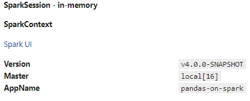

# Overview
This project provides daily built Docker images designed for data science workflows. These images include Debian Testing, JupyterLab, the master branch of Apache Spark, and the latest supported version of Pandas. They are optimized for both Docker and Kubernetes (k8s) environments, catering to a wide range of data processing and analysis needs.

## Features

- **Debian Testing**: Ensures a stable and up-to-date operating system environment.
- **JupyterLab**: Offers an interactive development environment for data science projects.
- **Apache Spark (master branch)**: Provides the latest features and improvements from the Apache Spark project. Only Python and K8S package included.
- **Pandas (latest Spark supported version)**: Includes the most recent enhancements and fixes from the Pandas library.

## How to Use

### Running with Docker

Change `JUPYTER_TOKEN: "Password"` to your desired password in the docker-compose.yaml file.

To get started with Docker, use the following command to pull and run the image:

```shell
docker-compose up -d
```

You can interact with the Apache Spark and Pandas frameworks directly from Python. Here's a brief setup for initializing a SparkSession and configuring it for your needs:

This configuration will start Spark utilizing all available memory and CPU cores on a single machine.

```python
import multiprocessing
import os
import numpy as np
import pandas as pd
import pyarrow as pa
from pyspark import pandas as ps
from pyspark.sql import SparkSession
import pyspark.sql.functions as SF

# Calculate the number of cores and memory usage for Spark configuration
number_cores = multiprocessing.cpu_count()
mem_bytes = os.sysconf("SC_PAGE_SIZE") * os.sysconf("SC_PHYS_PAGES")  # Total memory in bytes
memory_gb = int(mem_bytes / (1024.0 ** 3))  # Convert bytes to gigabytes

# Initialize a SparkSession with custom configurations
spark = (SparkSession.builder
         .appName("pandas-on-spark")
         .master(f"local[{number_cores}]")  # Use all available cores
         # Set driver memory to the calculated memory size
         .config("spark.driver.memory", f"{memory_gb}g")
         # Enable adaptive query execution, which can optimize query plans automatically
         .config("spark.sql.adaptive.enabled", "True")
         # Use KryoSerializer for better performance in shuffle and cache operations
         .config("spark.serializer", "org.apache.spark.serializer.KryoSerializer")
         # Limit the number of rows shown in eager evaluation output
         .config("spark.sql.repl.eagerEval.maxNumRows", "50")
         .getOrCreate())

# Optionally set log level to ERROR to reduce the amount of logs shown
spark.sparkContext.setLogLevel("ERROR")
```

`spark`



## Kubernetes Configuration

Run `kubectl label nodes <NODE> node-role=spark-driver` on the machine with the best specs. This is because `pandas-on-spark` will pull all data into the driver if the pandas function is not natively integrated in `pandas-on-spark`.

Run `kubectl label nodes <NODE> node-role=spark-worker` on every worker node you have in your K8S cluster.

This setup is tailored for data science workloads that require scalability and distributed processing capabilities.

```python

import numpy as np
import pandas as pd
import pyarrow as pa
from pyspark import pandas as ps
from pyspark.sql import SparkSession
import pyspark.sql.functions as SF

# Initialize a SparkSession with custom configurations
spark = SparkSession.builder \
  # Set the Spark master to connect to a Kubernetes cluster
  .master("k8s://https://kubernetes.default.svc.cluster.local:443") \
  # Specify the container image for the Spark worker nodes
  .config("spark.kubernetes.container.image", "bjornjorgensen/spark-worker") \
  # Set the pull policy for the container image to always pull the latest version
  .config("spark.kubernetes.container.image.pullPolicy", "Always") \
  # Configure authentication using a CA certificate file for Kubernetes
  .config("spark.kubernetes.authenticate.caCertFile", "/var/run/secrets/kubernetes.io/serviceaccount/ca.crt") \
  # Configure authentication using an OAuth token file for Kubernetes
  .config("spark.kubernetes.authenticate.oauthTokenFile", "/var/run/secrets/kubernetes.io/serviceaccount/token") \
  # Set the service account name for the Spark driver
  .config("spark.kubernetes.authenticate.driver.serviceAccountName", "my-pyspark-notebook") \
  # Set the number of executor instances to 4
  .config("spark.executor.instances", "4") \
  # Set the hostname for the Spark driver
  .config("spark.driver.host", "my-pyspark-notebook-spark-driver.default.svc.cluster.local") \
  # Set the port for the Spark driver
  .config("spark.driver.port", "29413") \
  # Enable eager evaluation in Spark SQL REPL
  .config("spark.sql.repl.eagerEval.enabled", "True") \
  # Set the memory for the Spark driver to 50GB
  .config("spark.driver.memory", "50g") \
  # Set the memory for each Spark executor to 13GB
  .config("spark.executor.memory", "13g") \
  # Set the number of cores for the Spark driver to 13
  .config("spark.driver.cores", "13") \
  # Set the number of cores for each Spark executor to 6
  .config("spark.executor.cores", "6") \
  # Configure a persistent volume claim named "300gb" for the Spark driver
  .config("spark.kubernetes.driver.volumes.persistentVolumeClaim.300gb.options.claimName", "300gb") \
  # Mount the persistent volume claim at the specified path in the driver container
  .config("spark.kubernetes.driver.volumes.persistentVolumeClaim.300gb.mount.path", "/opt/spark/work-dir") \
  # Set the mount for the persistent volume claim to be read-write
  .config("spark.kubernetes.driver.volumes.persistentVolumeClaim.300gb.mount.readOnly", "False") \
  # Configure the same persistent volume claim for the Spark executors
  .config("spark.kubernetes.executor.volumes.persistentVolumeClaim.300gb.options.claimName", "300gb") \
  .config("spark.kubernetes.executor.volumes.persistentVolumeClaim.300gb.mount.path", "/opt/spark/work-dir") \
  .config("spark.kubernetes.executor.volumes.persistentVolumeClaim.300gb.mount.readOnly", "False") \
  # Configure the access key for connecting to MinIO (S3-compatible storage)
  .config("fs.s3a.access.key", "minioadmin") \
  # Configure the secret key for connecting to MinIO
  .config("fs.s3a.secret.key", "Password") \
  # Set the endpoint URL for MinIO
  .config("fs.s3a.endpoint", "http://LOCALHOST:9000") \
  # Specify the implementation class for the S3 file system
  .config("spark.hadoop.fs.s3a.impl", "org.apache.hadoop.fs.s3a.S3AFileSystem") \
  # Enable path-style access for S3 (required for MinIO)
  .config("spark.hadoop.fs.s3a.path.style.access", "true") \
  # Set a node selector to run the Spark driver on nodes with the label "node-role=spark-driver"
  .config("spark.kubernetes.node.selector.node-role", "spark-driver") \
  # Set a node selector to run the Spark executors on nodes with the label "node-role=spark-worker"
  .config("spark.kubernetes.executor.node.selector.node-role", "spark-worker") \
  # Enable adaptive query execution in Spark SQL for automatic query optimization
  .config("spark.sql.adaptive.enabled", "True") \
  # Use Kryo serialization for improved performance in shuffle and cache operations
  .config("spark.serializer", "org.apache.spark.serializer.KryoSerializer") \
  # Limit the maximum number of rows displayed in eager evaluation output to 50
  .config("spark.sql.repl.eagerEval.maxNumRows", "50") \
  # Set the application name to "pandas-on-spark"
  .appName("pandas-on-spark") \
  # Create the SparkSession with the specified configurations
  .getOrCreate()
```
